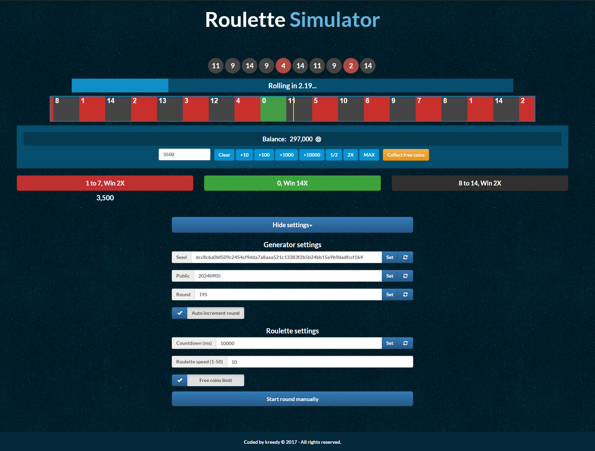

# About
Roulette simulator inspired by CSGODouble site utilizing the number generation algorithm from that website.

This is an old project from 2017 I created when learning the basics of JavaScript and Web development. I thought it was lost until I found it on an old Dropbox account.

You can use following function in console to add more coins:
```
addBalance(100000)
```

# Preview
